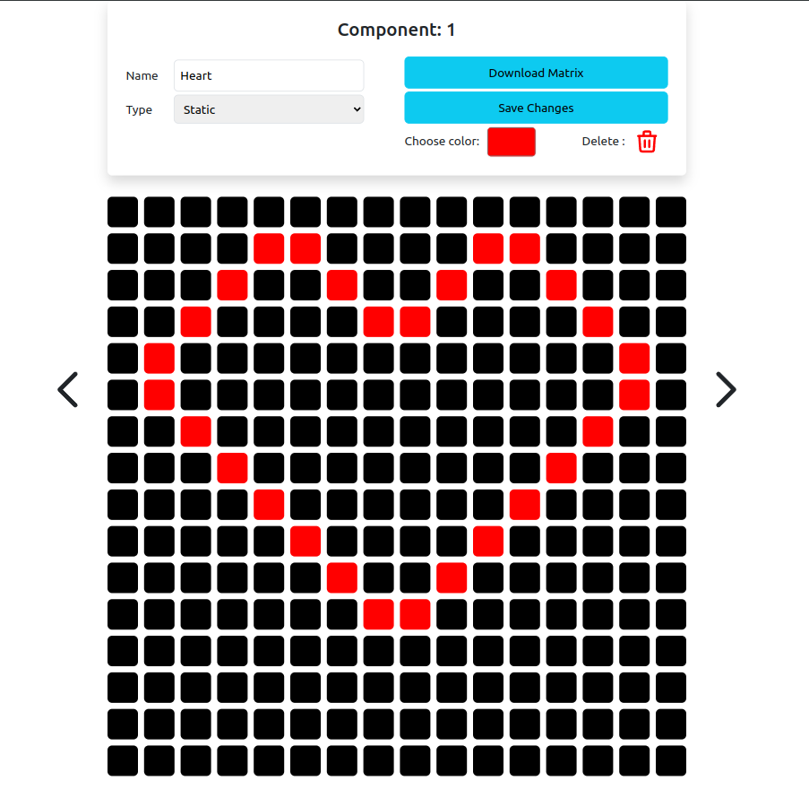
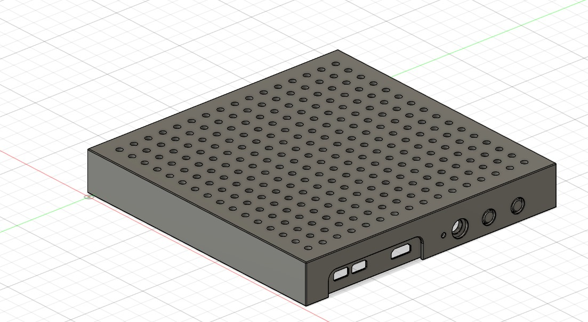
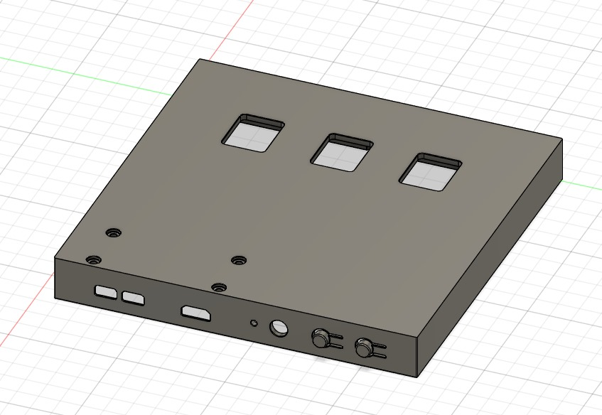
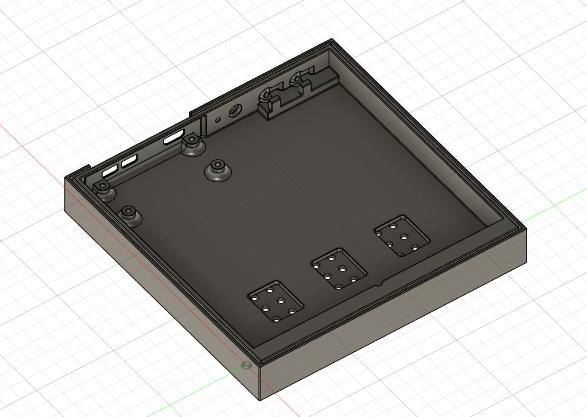
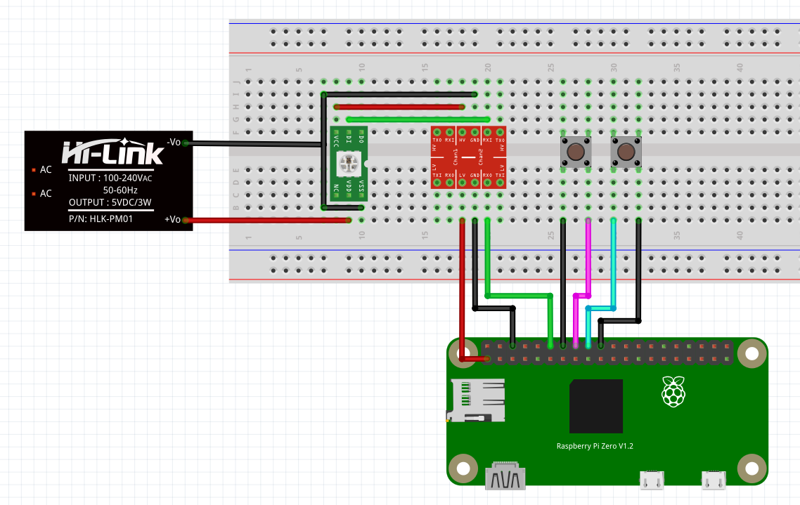

# LED NeoPixel Matrix Controller with Raspberry Pi Pico W2



This project allows you to control a 16x16 LED NeoPixel matrix using a Raspberry Pi Pico W2. 

## Features:
- Control LED matrix displays through a web interface.
- pixel art editor to create static and animated images 
- Interact with GPIO buttons on the Raspberry Pi to control the matrix.
- Backend API to communicate with the NeoPixel matrix.
- Fully containerized using Docker for seamless deployment.


## Components
- Raspberry Pi Pico W2
- Micro SD Card 
- 16x16 LED Matrix ( [build with BTF-LIGHTING WS2812BECO](https://www.amazon.de/dp/B088K1JH6X?ref=ppx_yo2ov_dt_b_fed_asin_title&th=1) )
- I2C Logik Level converter 3,3 V to 5 V 
- 2 Push Buttons
- DC Power Jack 5,5mm x 2,1mm ( [build with](https://www.amazon.de/dp/B08HGXYS4J?ref=ppx_yo2ov_dt_b_fed_asin_title) )
- Power Suply 5V 15A ( [build with ALITOVE Netzteil 5V 15A Universal Adapter 5 Volt Netzteil 75W](https://www.amazon.de/dp/B0B49ZN1LF?ref=ppx_yo2ov_dt_b_fed_asin_title&th=1) )

## Build Guide 

### Print the Case 





the stl files for the case are provided [here](./Build_Guide/stl/)

### Wiring 

wire up alle the componets acording to the folowing diagram 



some LED Matrixes have a deticated power imput if availabel use it 

make sure the wires are outed through the case before conecting the DC Power Jack

## Instalation guide  

### Installing Ubuntu Server 22.04.3 LTS (64-bit) on Raspberry Pi

Download and install the official Raspberry Pi Imager from (https://www.raspberrypi.com/software).
Choose the following parameters:

- Operating System: `Other general-purpose OS/Ubuntu/Ubuntu Server 22.04.3 LTS (32-bit)`.

in the Advanced Options Menu

- Set hostname: LED_Matrix
- Enable SSH with pasword authentication 
- Username: led
- Password: <pw>
- Configure a wireles LAN

### conect over ssh 

in your comand line type 

```bash
ssh led@<your-ip-adress>
```

and enter your pasword 


### Install Docker 

Insatll dependecies:
```bash
sudo apt install apt-transport-https ca-certificates curl software-properties-common
```

Add Docker’s official GPG key:
```bash
curl -fsSL https://download.docker.com/linux/ubuntu/gpg | sudo gpg --dearmor -o /usr/share/keyrings/docker-archive-keyring.gpg
```

Add Docker repository:
```bash
echo "deb [arch=$(dpkg --print-architecture) signed-by=/usr/share/keyrings/docker-archive-keyring.gpg] https://download.docker.com/linux/ubuntu $(lsb_release -cs) stable" | sudo tee /etc/apt/sources.list.d/docker.list > /dev/null
```

Update:
```bash
sudo apt update
```

Install Docker:
```bash
sudo apt install docker-ce
sudo apt install docker-compose-plugin
```

Varify instalation:
```bash
docker --version
docker-compose --version
```

Enable Docker to start on boot:
```bash
sudo systemctl enable docker

```

Add the User to the Docker Group
```bash
sudo usermod -aG docker led  
logout
groups
```

### Set firewal rules 


```bash
sudo apt install ufw
sudo ufw enable
```

```bash
sudo ufw allow 80/tcp
sudo ufw allow 8000/tcp
sudo ufw status
```


### Start the Container

first configure the env file 

```bash
cd ~/LED_Matrix_/src/Docker/
nano .env
```

add the follwoing lines 

```bash
# .env file
LATITUDE=
LONGITUDE=
TZ=Europe/Berlin  # Optional timezone setting
```


start the container 
```bash
cd ~/LED_Matrix_/src/Docker/
docker compose up -d
```

now you can acces the application at 

http://LED_Matrix.local


### additional comands 

stop the container 
```bash
cd ~/LED_Matrix_/src/Docker/
docker compose down
```