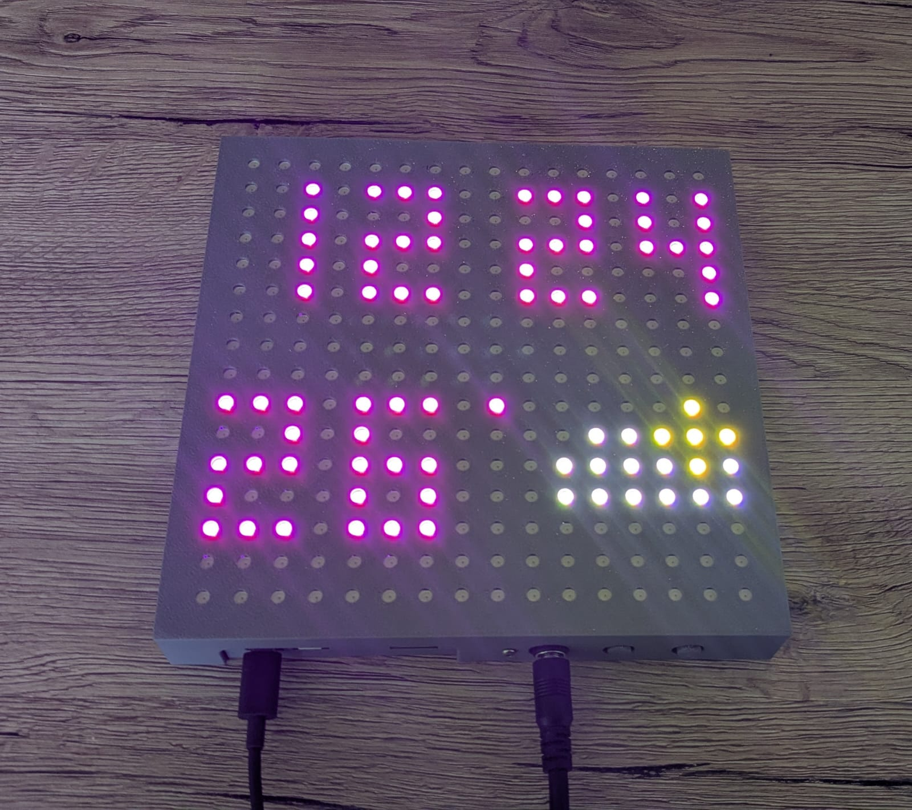
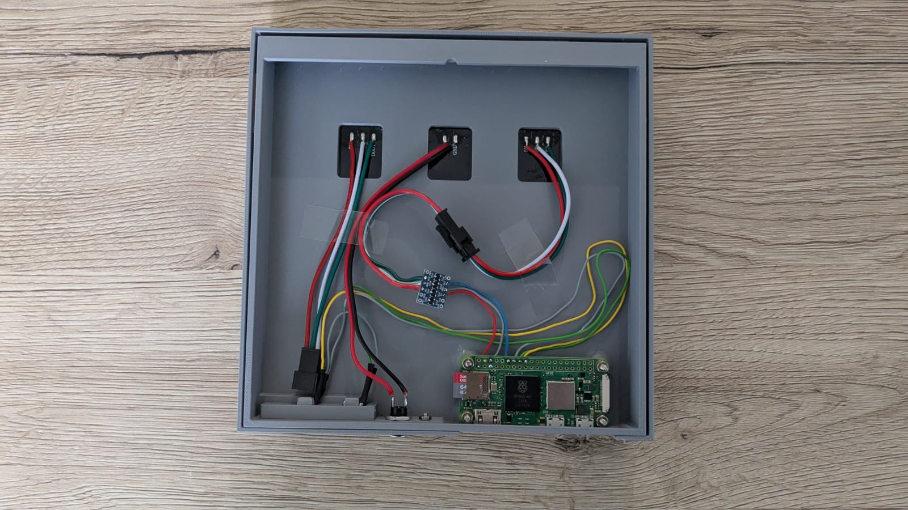
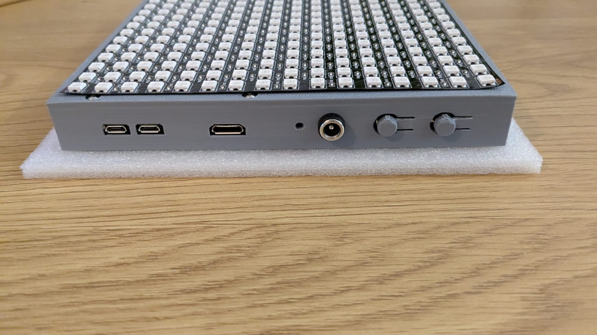
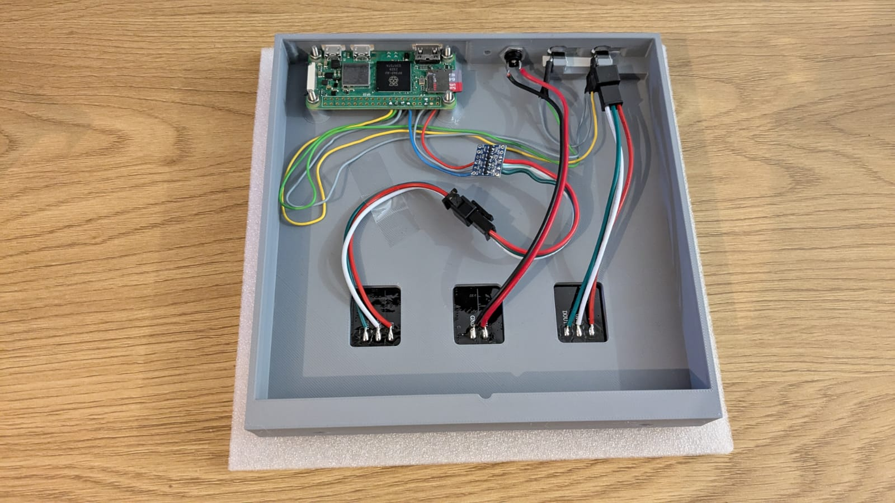

# LED NeoPixel Matrix Controller with Raspberry Pi Pico W2





This project allows you to control a 16x16 LED NeoPixel matrix using a Raspberry Pi Pico W2. 

## Features:
- Control LED matrix displays through a web interface
- Pixel art editor to create static and animated images
- Interact with GPIO buttons on the Raspberry Pi to control the matrix
- Backend API to communicate with the NeoPixel matrix
- Fully containerized using Docker for seamless deployment


## Components
- Raspberry Pi Pico W2
- Micro SD Card 
- 16x16 LED Matrix ( [build with BTF-LIGHTING WS2812BECO](https://www.amazon.de/dp/B088K1JH6X?ref=ppx_yo2ov_dt_b_fed_asin_title&th=1) )
- I2C Logic Level Converter 3.3V to 5V
- 2 Push Buttons
- DC Power Jack 5,5mm x 2,1mm ( [build with](https://www.amazon.de/dp/B08HGXYS4J?ref=ppx_yo2ov_dt_b_fed_asin_title) )
- Power Supply 5V 15A ( [build with ALITOVE Netzteil 5V 15A Universal Adapter 5 Volt Netzteil 75W](https://www.amazon.de/dp/B0B49ZN1LF?ref=ppx_yo2ov_dt_b_fed_asin_title&th=1) )

## Build Guide 

### Print the Case 


The STEP files for the case are provided [here](./Build_Guide/step/)

### Wiring 

Wire up all the components according to the following diagram:


Some LED matrices have a dedicated power input — if available, use it.

Make sure the wires are routed through the case before connecting the DC power jack.

Tape the matrix to the case with double-sided tape and secure the buttons in place




### Note About Matrix Choice

The LED matrix used in this example functions like a light strip, so the LEDs need to be addressed as an array according to the following scheme:

```bash
2 1 0 
3 4 5
8 7 6
```

If you want to use a different matrix, you might need to adapt the `get_index` function in [LEDMatrix](./src/backend/LEDMatrix/LEDMatrix.py)

## Installation Guide

### Installing Ubuntu Server 22.04.3 LTS (64-bit) on Raspberry Pi

Download and install the official Raspberry Pi Imager from (https://www.raspberrypi.com/software).
Choose the following parameters:

- Operating System: `Other general-purpose OS/Ubuntu/Ubuntu Server 22.04.3 LTS (32-bit)`.

in the Advanced Options Menu

- Set hostname: LED_Matrix
- Enable SSH with pasword authentication 
- Username: led
- Password: <pw>
- Configure a wireles LAN

### Connect Over SSH

In your command line, type:

```bash
ssh led@<your-ip-adress>
```

Then enter your password.


### Install Docker 

Install dependencies:
```bash
sudo apt install apt-transport-https ca-certificates curl software-properties-common
```

Add Docker’s official GPG key:
```bash
curl -fsSL https://download.docker.com/linux/ubuntu/gpg | sudo gpg --dearmor -o /usr/share/keyrings/docker-archive-keyring.gpg
```

Add Docker repository:
```bash
echo "deb [arch=$(dpkg --print-architecture) signed-by=/usr/share/keyrings/docker-archive-keyring.gpg] https://download.docker.com/linux/ubuntu $(lsb_release -cs) stable" | sudo tee /etc/apt/sources.list.d/docker.list > /dev/null
```

Update:
```bash
sudo apt update
```

Install Docker:
```bash
sudo apt install docker-ce
sudo apt install docker-compose-plugin
```

Varify instalation:
```bash
docker --version
docker-compose --version
```

Enable Docker to start on boot:
```bash
sudo systemctl enable docker

```

Add the User to the Docker Group
```bash
sudo usermod -aG docker led  
logout
groups
```

### Set firewal rules 


```bash
sudo apt install ufw
sudo ufw enable
```

```bash
sudo ufw allow 80/tcp
sudo ufw allow 8000/tcp
sudo ufw status
```


### Start the Container

First, configure the `.env` file:

```bash
cd ~/LED_Matrix_/src/Docker/
nano .env
```

Add the following lines:

```bash
# .env file
LATITUDE=
LONGITUDE=
TZ=Europe/Berlin  # Optional timezone setting
```


Start the container:
```bash
cd ~/LED_Matrix_/src/Docker/
docker compose up -d
```

Now you can access the application at:

http://LED_Matrix.local


### additional comands 

Stop the container:
```bash
cd ~/LED_Matrix_/src/Docker/
docker compose down
```

Rebuild the container:
```bash
cd ~/LED_Matrix_/src/Docker/
docker compose build
docker compose up -d
```
